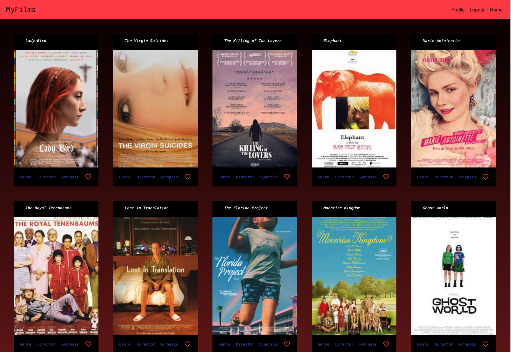

# MyFilmsAngularClient

### Hello and welcome to MyFilms, Angualar-style! 

This project is my second application using my MongoDB movie database.  The first MyFilms was built using React and Javascript, for this one, I used Angular and Typescript.  The functionality of the app is the same in both but I went for a different style for the Angular MyFilms.

## What can a user do on MyFilms?

Any user is able to register for an account in the registration view.  Once they have registered, they will need to use those credentials to log into the app. Once in, they will be greeted with a screen of twelve independent films.  A user can research each film by clicking on the 'genre', 'director', and 'synopsis' buttons.  Each button will open it's own dialog using Angular Material's dialog window function.  

If a user wants to save a movie to their profile, they can click on the heart-icon (also from Angular Material) and it will populate on their profile page under the heading, 'Favorite Movies.'  Also on the profile page, they can update their profile.  Watch out! There is a potential bug here, the user must input a password into the update form when updating any other fields or they will get hit with a nasty 404 error.  
It is in my future plans to remedy this situation.

## How was it made?

MyFilms, version 002, was built using HTML, SCSS, TypeScript, and Angular.  It was my first time writing code in Typescript and my first time using Angular.  I do appreciate that TypeScript and Angular are opinionated as it seems to save time when writing code to see an error immediately.  As a beginner, I also liked the clarity in the reasoning of the error when hovering over it.  When it comes to the Angular/React debate?  I am on the fence as both apps were my first using the respective frameworks.  I'll update this with my take after a few more projects and a bit more experience.

This project was generated with [Angular CLI](https://github.com/angular/angular-cli) version 17.0.10.

## Development server

Run `ng serve` for a dev server. Navigate to `http://localhost:4200/`. The application will automatically reload if you change any of the source files.

## Code scaffolding

Run `ng generate component component-name` to generate a new component. You can also use `ng generate directive|pipe|service|class|guard|interface|enum|module`.

## Build

Run `ng build` to build the project. The build artifacts will be stored in the `dist/` directory.

## Running unit tests

Run `ng test` to execute the unit tests via [Karma](https://karma-runner.github.io).

## Running end-to-end tests

Run `ng e2e` to execute the end-to-end tests via a platform of your choice. To use this command, you need to first add a package that implements end-to-end testing capabilities.

## Further help

To get more help on the Angular CLI use `ng help` or go check out the [Angular CLI Overview and Command Reference](https://angular.io/cli) page.
# myFilms-Angular-Client
